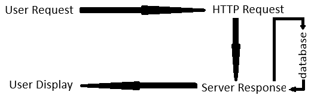

Access GTEx V10 protected data through the GTEx Portal and install it into a local MySQL database. Your project analyzes raw FASTQ files to generate TPM data. By comparing your TPM results with GTEx TPM from healthy tissues, you can gain valuable insights.

Web development protocols:
1) User access websites through web browsers.
2) The browser sends a request to the web server.
3) The server processes the request and may access a database (option)
4) The server sends a response back to the browser.
5) The browser displays the webpage securely using HTTPS.

  

